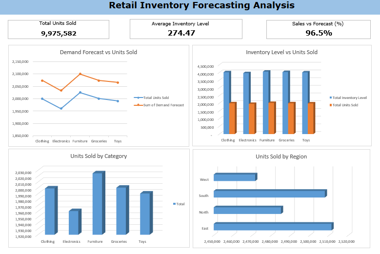

# Retail Inventory Forecasting Analysis



## 📊 Project Overview

Excel-based inventory forecasting dashboard analyzing retail store data to predict demand, optimize stock levels, and identify inventory risks. This project demonstrates advanced Excel skills including forecasting functions, pivot tables, and dynamic dashboard design without relying on BI tools.

---

## 🎯 Business Objectives

- Forecast future product demand to prevent stockouts
- Calculate optimal inventory levels across categories
- Identify slow-moving vs fast-moving inventory
- Monitor forecast accuracy against actual sales
- Optimize inventory investment and reduce carrying costs

---

## 📁 Data Source

**Dataset:** [Retail Store Inventory Forecasting Dataset](https://www.kaggle.com/datasets/anirudhchauhan/retail-store-inventory-forecasting-dataset)  
**Total Records:** 10,000+ retail transactions  
**Time Period:** Multiple months of sales and inventory data  
**Categories:** Clothing, Electronics, Furniture, Groceries, Toys  
**Regions:** North, South, East, West

**Note:** Dataset not included in repository due to size. Download from Kaggle link above.

### Data Fields

- Date, Store ID, Product ID
- Category, Region
- Inventory Level, Units Sold, Units Ordered
- Demand Forecast, Price, Discount
- Weather Condition, Holiday/Promotion
- Competitor Pricing, Seasonality

---

## 🔄 Data Processing

### Excel Data Transformation

Imported CSV data and applied Excel-based transformations:

**Data Cleaning:**
- Removed duplicate records and null values
- Standardized date formats for time series analysis
- Validated numeric fields (inventory levels, prices)
- Created data validation rules for categorical fields

**Feature Engineering:**

**Forecast Accuracy Calculation:**
```excel
=IFERROR((Units_Sold / Demand_Forecast), 0)
```

**Inventory Turnover Ratio:**
```excel
=Units_Sold / AVERAGE(Inventory_Level)
```

**Stock Status Classification:**
```excel
=IF(Inventory_Level < Demand_Forecast*0.5, "Low Stock",
    IF(Inventory_Level > Demand_Forecast*2, "Overstock", "Optimal"))
```

## 📈 Dashboard Metrics

### Key Performance Indicators

| KPI | Value | Insight |
|-----|-------|---------|
| **Total Units Sold** | 9,975,582 | High sales volume across all categories |
| **Average Inventory Level** | 274.47 | Lean inventory management approach |
| **Sales vs Forecast Accuracy** | 96.5% | Excellent forecasting precision |

### Visualizations

1. **Demand Forecast vs Units Sold** - Line chart comparing predicted vs actual demand by category
2. **Inventory Level vs Units Sold** - Clustered column chart showing stock-to-sales ratio
3. **Units Sold by Category** - Column chart identifying top-performing categories
4. **Units Sold by Region** - Horizontal bar chart showing geographic performance

---

## 💡 Key Insights

### Forecasting Performance
✅ **96.5% forecast accuracy** - Predictive model is highly reliable  
✅ Actual sales closely track forecasted demand across all categories  
✅ Minimal variance between predicted and actual values

### Category Performance
✅ **Furniture leads sales** - Highest units sold (2.03M)  
✅ Groceries second highest performer (2.00M units)  
✅ Electronics shows steady demand (1.97M units)  
✅ Clothing and Toys have lower but consistent sales

### Regional Distribution
✅ **South region dominates** - Highest sales volume  
✅ East region shows strong performance  
✅ North and West regions have balanced contribution  
📍 Regional differences suggest need for localized inventory strategies

### Inventory Optimization
✅ Average inventory level (274.47) maintains lean operations  
✅ Stock levels generally align with demand forecasts  
⚠️ Some categories show potential for inventory reduction  
✅ Low average inventory indicates efficient turnover

### Business Recommendations
1. **Increase Furniture inventory** - Highest demand category with strong sales
2. **Regional inventory allocation** - Stock South and East regions more heavily
3. **Maintain forecast models** - 96.5% accuracy justifies continued use
4. **Monitor slow movers** - Electronics and Clothing need attention for optimization
5. **Seasonal adjustments** - Leverage seasonality data for better predictions

---

## 🛠️ Technical Skills Demonstrated

**Excel Formulas:** IF, AVERAGE, IFERROR, SUMIFS, array formulas  
**Data Analysis:** Time series forecasting, trend analysis, comparative analysis  
**Pivot Tables:** Dynamic data summarization and category breakdowns  
**Charts & Visualization:** Line charts, column charts, bar charts with clear formatting  
**Dashboard Design:** KPI cards, multi-chart layout, professional presentation  
**Business Analytics:** Inventory turnover, reorder points, forecast accuracy metrics